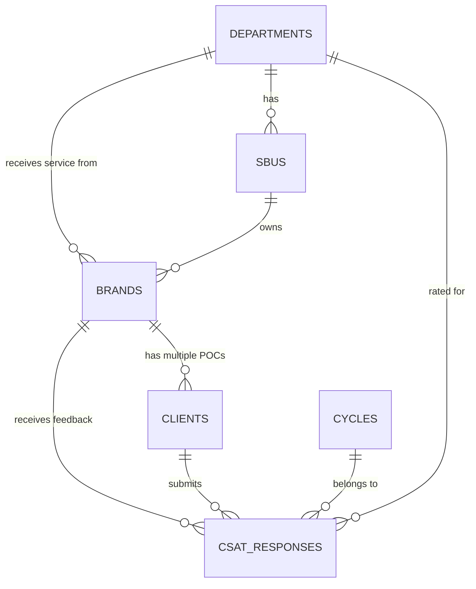
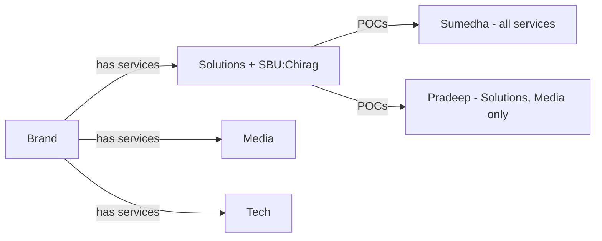

# CSAT Server MongoDB Database Schema Design

## Overview

Design a MongoDB database schema for the CSAT (Customer Satisfaction) server that supports:

- Multi-department CSAT tracking (Brand Solutions, Media, Tech, SEO, MarTech, Fluence, SMP)
- SBU/POD-wise brand ownership (POD and SBU are equivalent terms)
- Cycle-based CSAT collection (6 cycles per year: May-December)
- Flexible/schemaless CSAT response data storage
- POC (Point of Contact) management per brand per service

---

## Entity Relationship Diagram



---

## Proposed Collections

### 1. `departments` - Service Line Definitions

Stores the 7 departments/service lines available in the CSAT system.

#### [NEW] department.model.js

```javascript
const departmentSchema = new mongoose.Schema(
  {
    name: { type: String, required: true, unique: true }, // e.g., "Brand Solutions", "Media"
    code: { type: String, required: true, unique: true }, // e.g., "solutions", "media", "tech"
    isActive: { type: Boolean, default: true },
  },
  { timestamps: true, collection: 'departments' }
);
```

> [!NOTE]
> POD and SBU are equivalent terms. All departments can have SBUs assigned.

**Initial Data:**
| name | code |
|------|------|
| Brand Solutions | solutions |
| Media | media |
| Tech | tech |
| SEO | seo |
| MarTech | martech |
| Fluence | fluence |
| SMP | smp |

---

### 2. `sbus` - Strategic Business Units (PODs)

Stores SBU/POD definitions. POD and SBU are equivalent terms - all departments can have SBUs.

#### [NEW] sbu.model.js

```javascript
const sbuSchema = new mongoose.Schema(
  {
    name: { type: String, required: true, unique: true }, // e.g., "Chirag", "Dhruv + Malka"
    slug: { type: String, required: true, unique: true }, // e.g., "chirag", "dhruv-malka"
    departmentId: {
      type: mongoose.Schema.Types.ObjectId,
      ref: 'Department',
      required: true,
    },
    leadNames: [{ type: String }], // Array of lead names for combined PODs
    isActive: { type: Boolean, default: true },
  },
  { timestamps: true, collection: 'sbus' }
);

// Indexes
sbuSchema.index({ departmentId: 1 });
sbuSchema.index({ name: 'text' });
```

**Sample Data (from dept-brand-service.md):**

- Chirag, Samarth, Shreya, Sumesh, Vrinda, Amit
- Dhruv + Malka, Dhruv + Aniket, Dhruv + Ria, Dhruv + Jainik
- Rohan + Batul + Reuben, Rohan + Yohann, Rohan + Varsha
- Afshaad, Afshaad + Eric

---

### 3. `brands` - Client/Brand Master Data

Stores brand information with service mappings and ownership details.

#### [NEW] brand.model.js

```javascript
const VALID_DEPARTMENTS = [
  'solutions',
  'media',
  'tech',
  'seo',
  'martech',
  'fluence',
  'smp',
];

const brandSchema = new mongoose.Schema(
  {
    name: { type: String, required: true, trim: true },
    slug: { type: String, required: true, unique: true, lowercase: true },

    // Second Brain integration
    secondBrainId: { type: Number, default: null, sparse: true },

    // Department-Service Mapping (which departments this brand uses)
    services: [
      {
        department: { type: String, enum: VALID_DEPARTMENTS, required: true },
        sbuId: {
          type: mongoose.Schema.Types.ObjectId,
          ref: 'SBU',
          default: null,
        },
        isActive: { type: Boolean, default: true },
        startDate: { type: Date, default: Date.now },
        endDate: { type: Date, default: null }, // null = ongoing
      },
    ],

    isActive: { type: Boolean, default: true },
  },
  { timestamps: true, collection: 'brands' }
);

// Indexes
brandSchema.index({ name: 1 });
brandSchema.index({ slug: 1 }, { unique: true });
brandSchema.index({ 'services.department': 1 });
brandSchema.index({ 'services.sbuId': 1 });
brandSchema.index({ secondBrainId: 1 }, { sparse: true });
```

> [!IMPORTANT]
> A brand can have MULTIPLE departments (e.g., Bridgestone uses Solutions, Media, Tech, SEO, MarTech, Fluence). The `services` array captures this many-to-many relationship.

---

### 4. `clients` - Brand POC/Contact Information

Stores client point-of-contact (POC) details. One brand can have multiple POCs, and the same person may be POC for different services.

#### [NEW] client.model.js

```javascript
const clientSchema = new mongoose.Schema(
  {
    brandId: {
      type: mongoose.Schema.Types.ObjectId,
      ref: 'Brand',
      required: true,
    },
    name: { type: String, required: true, trim: true },
    phone: { type: String, required: true, trim: true },
    email: { type: String, trim: true, lowercase: true },

    // Which departments/services this POC is responsible for
    serviceMapping: [
      {
        department: { type: String, required: true },
        isActive: { type: Boolean, default: true },
      },
    ],

    isActive: { type: Boolean, default: true },
  },
  { timestamps: true, collection: 'clients' }
);

// Indexes
clientSchema.index({ brandId: 1 });
clientSchema.index({ phone: 1 });
clientSchema.index({ 'serviceMapping.department': 1 });

// Compound unique: same person shouldn't be duplicated for same brand+phone
clientSchema.index({ brandId: 1, phone: 1 }, { unique: true });
```

> [!NOTE]
> Based on `brand_service_segregation.md`, a single POC (e.g., "Sumedha Sharma" from Bridgestone) can be mapped to multiple services (Solutions, Media, Tech, SEO, MarTech, Fluence). The `serviceMapping` array captures this.

---

### 5. `cycles` - CSAT Collection Cycles

Stores CSAT cycle definitions. 6 cycles per year from May to December.

#### [NEW] cycle.model.js

```javascript
const cycleSchema = new mongoose.Schema(
  {
    name: { type: String, required: true }, // e.g., "Cycle 1", "Cycle 5"
    cycleNumber: { type: Number, required: true, min: 1, max: 6 },
    year: { type: Number, required: true },

    // Cycle date range
    startDate: { type: Date, required: true },
    endDate: { type: Date, required: true },

    // Cycle status
    status: {
      type: String,
      enum: ['upcoming', 'active', 'closed'],
      default: 'upcoming',
    },

    isActive: { type: Boolean, default: true },
  },
  { timestamps: true, collection: 'cycles' }
);

// Compound unique: one cycle per number per year
cycleSchema.index({ year: 1, cycleNumber: 1 }, { unique: true });
cycleSchema.index({ status: 1 });
cycleSchema.index({ startDate: 1, endDate: 1 });
```

**Cycle Mapping (per PRD):**
| Cycle | Month |
|-------|-------|
| Cycle 1 | May |
| Cycle 2 | June-July |
| Cycle 3 | August |
| Cycle 4 | September-October |
| Cycle 5 | November |
| Cycle 6 | December |

---

### 6. `csat_responses` - CSAT Survey Responses

Stores individual CSAT survey responses. Uses **schemaless** approach for the actual rating data (like nsm-server's Mixed type pattern).

#### [NEW] csatResponse.model.js

```javascript
const csatResponseSchema = new mongoose.Schema(
  {
    // Core relationships
    brandId: {
      type: mongoose.Schema.Types.ObjectId,
      ref: 'Brand',
      required: true,
    },
    clientId: {
      type: mongoose.Schema.Types.ObjectId,
      ref: 'Client',
      required: true,
    },
    cycleId: {
      type: mongoose.Schema.Types.ObjectId,
      ref: 'Cycle',
      required: true,
    },
    departmentId: {
      type: mongoose.Schema.Types.ObjectId,
      ref: 'Department',
      required: true,
    },

    // SBU reference
    sbuId: {
      type: mongoose.Schema.Types.ObjectId,
      ref: 'SBU',
      default: null,
    },

    // Submission info
    submittedAt: { type: Date, default: Date.now },

    // Calculated/extracted scores (for quick queries & aggregations)
    csatScore: { type: Number, min: 0, max: 5 }, // 0-5 scale
    npsScore: { type: Number, min: 0, max: 10 }, // 0-10 scale

    /**
     * SCHEMALESS: Raw survey response data
     * Stores department-specific ratings and all form data
     *
     * Real Example (Brand Solutions):
     * {
     *   servicesCovered: {
     *     solutions: true, media: false, tech: false,
     *     seo: false, martech: false, fluence: false, smp: false
     *   },
     *   coreMetrics: {
     *     overallSatisfaction: 4,
     *     likelihoodToRecommend: 4,
     *     northStarMetrics: 4,
     *     seniorLeadershipInvolvement: 4,
     *     strategyExecution: 4,
     *     teamResponsiveness: 4,
     *     brandUnderstanding: 4
     *   },
     *   deliveryMetrics: {
     *     dataEffectiveness: 4,
     *     teamProactivity: 4,
     *     meetingBusinessGoals: 4
     *   },
     *   qualityEvaluation: {
     *     qualityOfDesignVideo: 0,
     *     qualityOfIdeas: 0
     *   },
     *   formVersion: "v1",
     *   filledAt: "2025-12-16T11:02:00.000Z"
     * }
     */
    data: {
      type: mongoose.Schema.Types.Mixed,
      required: true,
    },

    // Additional fields
    comment: { type: String, trim: true }, // Quick access to main comment

    isValid: { type: Boolean, default: true }, // For data quality flagging
  },
  { timestamps: true, collection: 'csat_responses' }
);

// Indexes
csatResponseSchema.index({ brandId: 1, cycleId: 1 });
csatResponseSchema.index({ clientId: 1 });
csatResponseSchema.index({ departmentId: 1, cycleId: 1 });
csatResponseSchema.index({ sbuId: 1, cycleId: 1 });
csatResponseSchema.index({ submittedAt: -1 });
csatResponseSchema.index({ csatScore: 1 });

// Compound index for common queries
csatResponseSchema.index({ cycleId: 1, departmentId: 1, sbuId: 1 });
```

> [!IMPORTANT]
> The `data` field uses `Mixed` type for **schemaless storage**. This allows storing different question formats, additional metadata, and future form changes without schema migrations. Extracted scores (`csatScore`, `npsScore`) are stored separately for efficient aggregation queries.

---

## Data Flow & Key Design Decisions

### 1. Brand-Service Relationship



### 2. CSAT Response Hierarchy

```
Financial Year (2025)
  └── Cycle (Cycle 5 - November)
       └── Department (Brand Solutions)
            └── SBU (Chirag)
                 └── Brand (Bridgestone Tyres)
                      └── Client POC (Sumedha Sharma)
                           └── CSAT Response {schemaless data}
```

### 3. Why Schemaless for CSAT Data?

| Aspect                      | Benefit                                                                       |
| --------------------------- | ----------------------------------------------------------------------------- |
| **Flexibility**             | Survey questions can change per cycle without DB migrations                   |
| **Future-proof**            | New question types, scoring systems can be added easily                       |
| **Raw Data Preservation**   | Original form submission is preserved as-is                                   |
| **Pattern from nsm-server** | Same approach used for `sprout` and `windsor` fields in `nsmMetrics.model.js` |

### 4. Real CSAT Response Example

**Brand Solutions Response:**
| Field | Value |
|-------|-------|
| Brand | Amazon SEA |
| Brand POC | Michelle Chua |
| Phone | 1111111111 |
| SBU (POD) | Chirag |
| Department | Brand Solutions |
| Cycle | Cycle 5 |
| Submitted | 16 Dec 2025, 11:02 AM |

**Services Covered:** Solutions ✔️ | Media ❌ | Tech ❌ | SEO ❌ | MarTech ❌ | Fluence ❌ | SMP ❌

**Rating Categories (0-5 scale):**

- **Core Metrics:** Overall Satisfaction, Likelihood to Recommend, North Star Metrics, Senior Leadership Involvement, Strategy Execution, Team Responsiveness, Brand Understanding
- **Delivery Metrics:** Data Effectiveness, Team Proactivity, Meeting Business Goals
- **Quality Evaluation:** Quality of Design & Video, Quality of Ideas

**Client Feedback:** _"Better. Available for calls. The team has been responsive and helpful."_

---

## Index Summary

| Collection       | Indexes                                                                                                                                       |
| ---------------- | --------------------------------------------------------------------------------------------------------------------------------------------- |
| `departments`    | `name` (unique), `code` (unique)                                                                                                              |
| `sbus`           | `name` (unique), `departmentId`, text search on `name`                                                                                        |
| `brands`         | `name`, `slug` (unique), `services.department`, `services.sbuId`, `secondBrainId`                                                             |
| `clients`        | `brandId`, `phone`, `serviceMapping.department`, `(brandId, phone)` unique                                                                    |
| `cycles`         | `(year, cycleNumber)` unique, `status`, `(startDate, endDate)`                                                                                |
| `csat_responses` | `(brandId, cycleId)`, `clientId`, `(departmentId, cycleId)`, `(sbuId, cycleId)`, `submittedAt`, `csatScore`, `(cycleId, departmentId, sbuId)` |

---

## File Structure

```
csat-server/
└── src/
    └── models/
        ├── index.js              # Export all models
        ├── department.model.js   # Department definitions
        ├── sbu.model.js          # SBU/POD definitions
        ├── brand.model.js        # Brand master data
        ├── client.model.js       # POC/Contact data
        ├── cycle.model.js        # CSAT cycles
        └── csatResponse.model.js # CSAT responses (schemaless data)
```

---

## Verification Plan

### Initial Setup Verification

1. Create the model files in `csat-server/src/models/`
2. Create seed script to populate initial data (departments, sample SBUs)
3. Run the server and verify MongoDB collections are created correctly

### Manual Verification

1. **Check MongoDB Collections**: Connect to MongoDB and verify all 6 collections exist with correct indexes
2. **Test Relationships**: Insert sample data and verify references work correctly
3. **Test Schemaless Storage**: Insert CSAT responses with varying `data` structures

---

## Key Decisions

> [!IMPORTANT]
>
> 1. **Schemaless CSAT data** - Using `Mixed` type for flexible survey data storage
> 2. **Service mapping on Brand** - Each brand stores which departments it uses
> 3. **Client-Service mapping** - Each POC can be linked to specific departments
> 4. **SBU for all departments** - POD and SBU are the same, all departments can have SBUs
> 5. **Extracted scores** - `csatScore` and `npsScore` stored separately for aggregation
